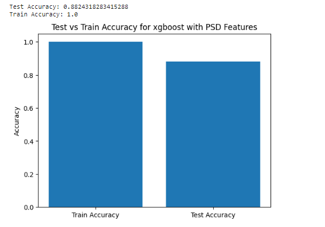
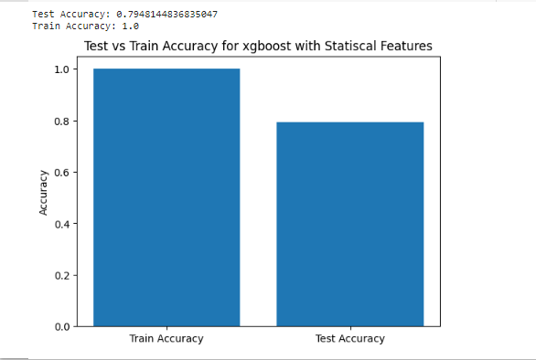
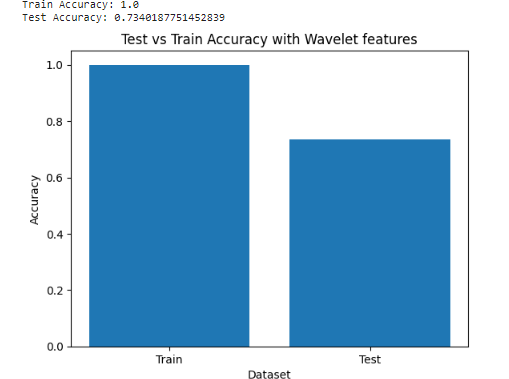
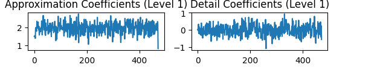
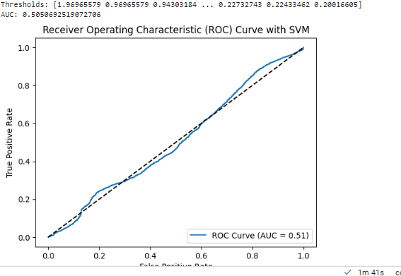
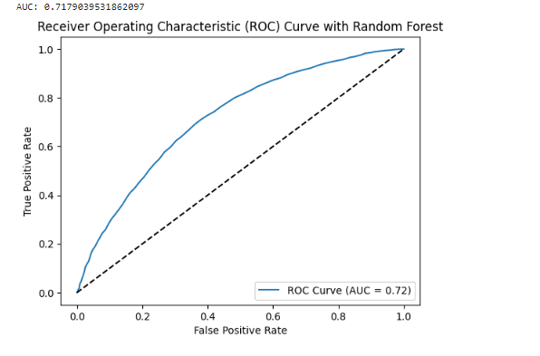
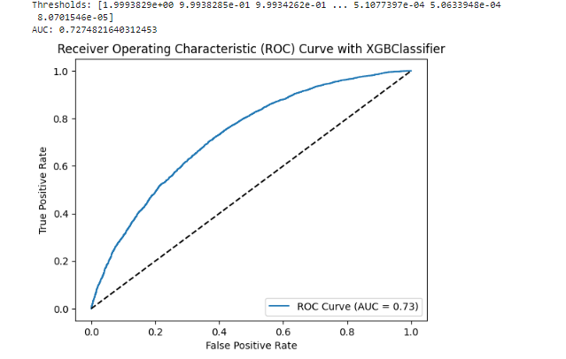

# Epilespy-EEG-Signals
Classify People as Epilespy and Normal people we cleaning DatasSet Then we Do Feature Extraction Then Modeling 
### how to run the project
```python
   Google Colab
```
## Table of Contents
- [Project Description](#project-description)

- [Tools and Frameworks](#tools-and-frameworks)
- [Code Examples](#code-examples

- [Installation](#installation)
- [How to use](#How-to-use)
- [Licence](#Licence)

## Project Description
Firstly we Cleaned the dataset as we remove Outliers and Filtering the data from Non-EEG Signals and we started using many Algorithms AS Wavelet , Statiscal ,PSD  and Entropy then we start modeling as we create label vector to use with training and test phase in modeling and compare each of them To others then we use AUC-ROC Curve AS It allows you to visually assess the trade-off between the true positive rate and false positive rate, helping to understand the classifier's effectiveness at different decision thresholds

### Here we use PsD as feature Extraction 

### Here we use mean , variance and z-score as feature Extraction 

### Here we use Wavelets as feature Extraction 

Here Level 1 Wavelet Decomposition:

Apply a low-pass filter (LPF) and a high-pass filter (HPF) to the signal.
The LPF extracts the low-frequency components, and the HPF extracts the high-frequency components.
After filtering, we obtain the following:
Low-frequency components (approximation coefficients A1): [6.0, 7.0, 5.0, 2.5].
High-frequency components (detail coefficients D1): [-0.5, 1.5, 0.5, -0.5].
The approximation coefficients capture the overall trend or low-frequency components, while the detail coefficients capture the high-frequency or transient features of the signal.
Level 2 Wavelet Decomposition:

Apply the same process to the approximation coefficients (A1) obtained from Level 1.
Again, apply an LPF and an HPF to the approximation coefficients.
After filtering and downsampling, we obtain the following:
Approximation coefficients (A2): [6.5, 1.0].
Detail coefficients (D2): [-0.5, 0.0].
The approximation coefficients at this level capture the overall trend at a finer scale, while the detail coefficients capture the high-frequency details.


An AUC-ROC curve is a graphical representation of the performance of a binary classifier, such as SVM (Support Vector Machine), at different classification thresholds. The AUC (Area Under the Curve) represents the performance of the classifier in terms of the trade-off between its true positive rate (TPR) and false positive rate (FPR).

An AUC of 50.50% indicates that the classifier's performance is essentially random or equivalent to chance. In other words, the classifier is not able to discriminate between the positive and negative samples effectively. An AUC of 0.5 corresponds to a classifier that is no better than flipping a coin to make predictions.


An AUC-ROC curve is a graphical representation of the performance of a binary classifier, such as Random Forest, at different classification thresholds. The AUC (Area Under the Curve) represents the performance of the classifier in terms of the trade-off between its true positive rate (TPR) and false positive rate (FPR).

An AUC of 71.80% indicates that the Random Forest classifier has achieved a reasonable level of discrimination between the positive and negative samples. The higher the AUC, the better the classifier is at distinguishing between the two classes.

Compared to an AUC of 50.50% (random or equivalent to chance), an AUC of 71.80% indicates that the Random Forest classifier is performing significantly better. It suggests that the classifier is able to capture meaningful patterns and make better predictions compared to random chance.





An AUC-ROC curve is a graphical representation of the performance of a binary classifier, such as XGBoost, at different classification thresholds. The AUC (Area Under the Curve) represents the performance of the classifier in terms of the trade-off between its true positive rate (TPR) and false positive rate (FPR).

An AUC of 73% indicates that the XGBoost classifier has achieved a reasonably good level of discrimination between the positive and negative samples. The higher the AUC, the better the classifier is at distinguishing between the two classes.

Compared to an AUC of 50.50% (random or equivalent to chance), an AUC of 73% indicates that the XGBoost classifier is performing significantly better and has learned meaningful patterns from the data.



### Title 
Classification Epilespy (EEG Signals) 
### Course 
BSc Thesis under Supervisor Dr.Wael Zakria
### Theme
The theme of the project, is to create Tool instead of Expensive Machines as EEG signal device is more Accurate and cheaper compare to Old Machines 


### Objectives
- Learn how to Clean Data .
- Learn the process of Signal Processing  Techniques .
- Learn to research and master the use of the Feature Extraction Methods .
- Learn how Train Models and comparing acc from different features with different  classifier .

## Tools and Frameworks
Google Colab with MNE Library :MNe (assuming it's a typo for NumPy library) and scikit-learn (often abbreviated as sklearn) are popular tools and frameworks in the field of machine learning and data analysis. Here's a brief overview of each tool and how you can use them, including cross-validation and data visualization with matplotlib.

NumPy (MNe):

NumPy is a fundamental package in Python for scientific computing and numerical operations.
It provides support for efficient array operations and mathematical functions.
To install NumPy, you can use the following command: pip install numpy
You can import NumPy in your Python code using: import numpy as np
NumPy documentation: https://numpy.org/doc/
scikit-learn (sklearn):

scikit-learn is a powerful machine learning library in Python, offering a wide range of tools and algorithms for data preprocessing, model training, evaluation, and more.
It provides easy-to-use interfaces to implement various machine learning techniques.
To install scikit-learn, you can use the following command: pip install scikit-learn
You can import scikit-learn in your Python code using: import sklearn
scikit-learn documentation: https://scikit-learn.org/stable/
Cross-Validation:

Cross-validation is a technique used to evaluate machine learning models by dividing the available data into subsets for training and testing.
scikit-learn provides a module called model_selection that includes several methods for cross-validation, such as KFold, StratifiedKFold, train_test_split, etc.

## Build Status 
 - The project currently under development and there are some styling problems to be fixed 
- jest tests to be added

